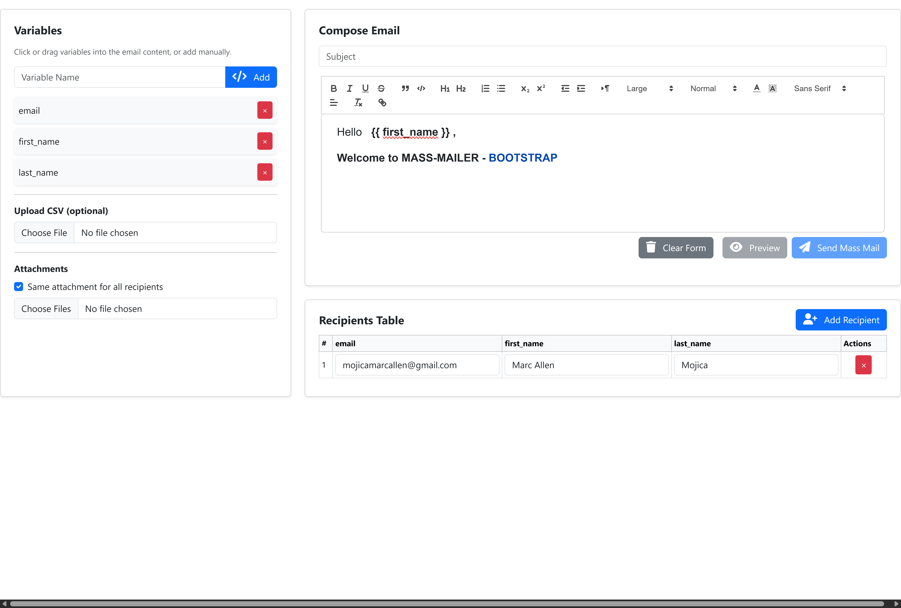
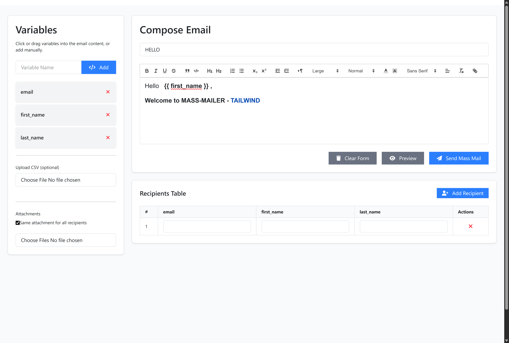

# Mass Mailer

A Laravel package for sending personalized mass emails with Livewire. Features a clean interface that works with both Bootstrap and Tailwind CSS frameworks.

## ✨ Features

- **🎯 Smart Personalization** - Use variables like `{{ first_name }}`, `{{ email }}` for personalized content
- **📊 CSV Import** - Upload recipient lists with automatic data mapping
- **📎 Flexible Attachments** - Global attachments for all recipients or individual ones per person
- **✨ Rich Text Editor** - Compose emails with formatting using Quill.js
- **👥 Multiple Senders** - Switch between different email accounts/senders
- **👀 Email Preview** - See exactly how your email will look before sending
- **⚡ Background Processing** - Queue-based sending for better performance
- **🎨 Dual Framework Support** - Choose between Bootstrap 5 or Tailwind CSS
- **📱 Fully Responsive** - Works perfectly on all devices
- **🔒 Secure & Configurable** - File validation, rate limiting, and customizable settings

## 📸 Screenshots

### Bootstrap Version


### Tailwind Version


## 🚀 Quick Start

```bash
composer require mrclln/mass-mailer
```

### Basic Setup

1. **Install the package**
```bash
composer require mrclln/mass-mailer
```

2. **Publish configuration** (optional, for customization)
```bash
php artisan vendor:publish --provider="Mrclln\MassMailer\Providers\MassMailerServiceProvider" --tag="mass-mailer-config"
```

3. **Enable logging** (optional, for tracking sent emails)
```bash
php artisan vendor:publish --provider="Mrclln\MassMailer\Providers\MassMailerServiceProvider" --tag="mass-mailer-migrations"
php artisan migrate
```
If the provider is **not automatically added**, open:
bootstrap/providers.php
and add:
```bash
return [
    // Other providers...
    Mrclln\MassMailer\Providers\MassMailerServiceProvider::class,
];
```
4. **Choose your UI style** in `.env`
```bash
MASS_MAILER_UI_FRAMEWORK=bootstrap  # or 'tailwind'
```

## 🎯 How to Use

Add to any Blade view:

```blade
@livewire('mass-mailer')
```

Or use the component syntax:

```html
<livewire:mass-mailer />
```

## 🎨 UI Framework Support

The package automatically adapts to your chosen framework:

### Bootstrap 5
- Clean, professional interface
- Bootstrap components and styling
- Perfect for existing Bootstrap projects

### Tailwind CSS
- Modern utility-first design
- Consistent with Tailwind projects
- Highly customizable

Both versions have identical functionality and features.

## ⚙️ Key Features Explained

### Personalization with Variables
Create custom variables and drag them into your emails:
- `{{ first_name }}` - Recipient's first name
- `{{ email }}` - Their email address
- Any custom variables you create

### CSV Import
Upload recipient data easily:
```csv
email,first_name,last_name,company
john@example.com,John,Doe,Acme Corp
jane@example.com,Jane,Smith,Tech Inc
```

### Multiple Senders
Configure different email accounts and even attach senders to user models for dynamic sender management:

```php
// In config/mass-mailer.php
'multiple_senders' => true,
'senders' => [
    ['name' => 'Support', 'email' => 'support@company.com'],
    ['name' => 'Sales', 'email' => 'sales@company.com'],
]

// Or load from database/user model:
'sender_model' => 'App\Models\User', // or custom sender model
// Then in your User model:
return $this->hasMany(MassMailerSender::class);
```

**Benefits of User Model Attachment:**
- Each user can have their own sender profiles
- Perfect for multi-tenant applications
- Dynamic sender loading based on authenticated user
- Easy to manage sender permissions per user
- Supports complex business logic for sender selection

### Attachments
- **Global**: Same file for all recipients
- **Per-recipient**: Individual files for each person
- Supports PDF, DOC, images, and more

## 🔧 Configuration Options

Customize in `config/mass-mailer.php`:

- **Queue Settings**: Background processing configuration
- **Batch Size**: Emails per batch (default: 50)
- **Rate Limiting**: Max emails per minute
- **File Uploads**: Size limits and allowed file types
- **UI Framework**: Bootstrap or Tailwind
- **Multiple Senders**: Enable sender switching

## 📋 Requirements

- PHP 8.1+
- Laravel 10.0, 11.0, or 12.0
- Livewire 3.0+
- Database (optional, for logging)

---

Built by an individual developer sharing open source projects. This package helps make mass emailing simple and effective!
